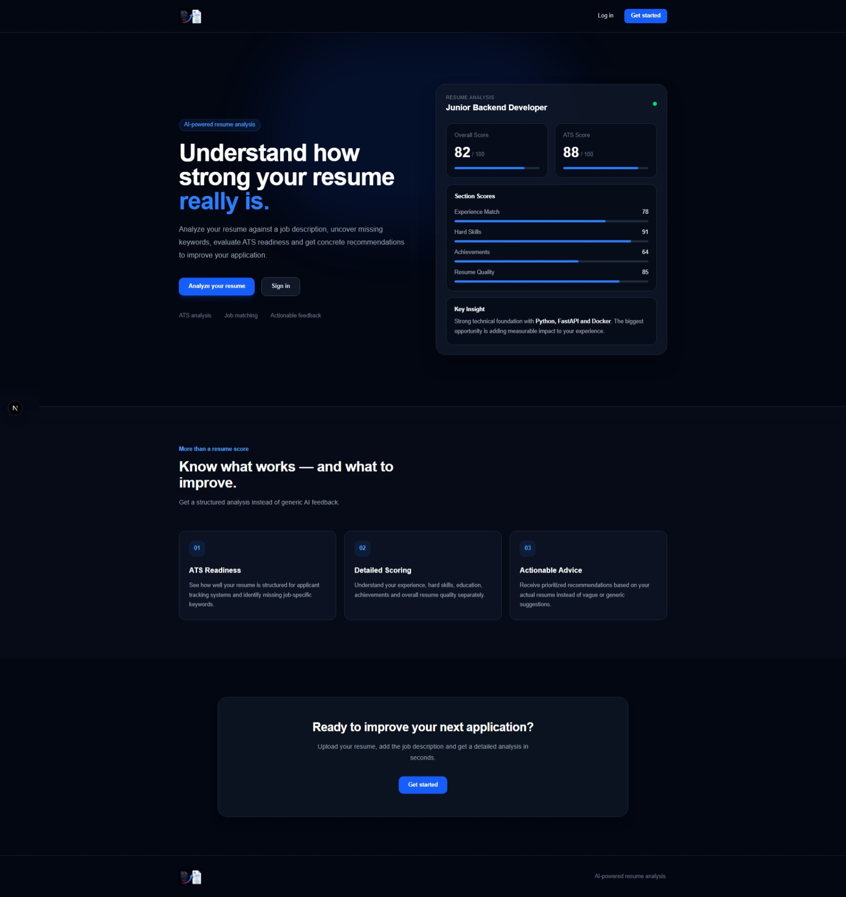
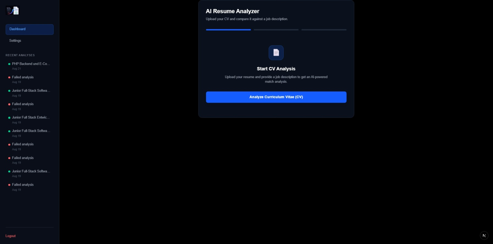
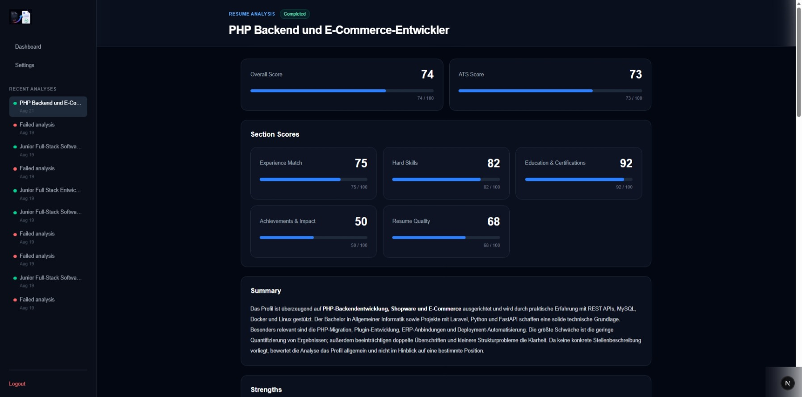
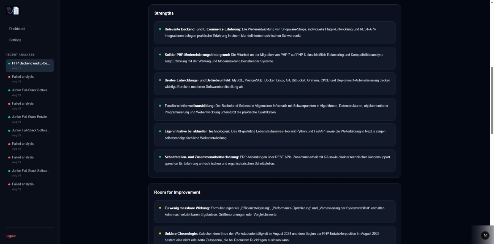
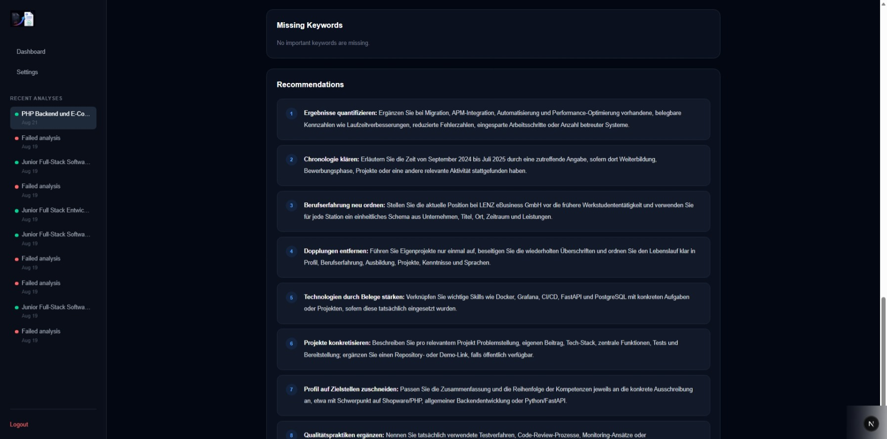

# AI Resume Analyzer

A full-stack web app that analyzes a resume against a job description using OpenAI, and streams the results back to the browser live as they're generated.

You upload a resume (PDF) and paste in a job description. The backend extracts the resume text, sends it to OpenAI with a structured output schema, and returns scores, strengths, gaps, missing keywords, and concrete recommendations — streamed field by field over SSE so the UI fills in progressively instead of showing a blank loading spinner.

## Features

- Email/password signup and login, JWT stored in an HttpOnly cookie
- Upload a PDF resume and a job description, pick between three AI model presets (fast / standard / expert)
- Live-streaming analysis: overall score, ATS score, five section scores (experience match, hard skills, education & certifications, achievements & impact, resume quality), a written summary, strengths, room for improvement, missing keywords, and prioritized recommendations
- Analysis history in the sidebar, with status (processing / completed / failed) that keeps polling until it settles
- Reloading or opening an analysis directly (not just right after creating it) loads the same result from the database instead of the live stream
- Resume text extraction via Apache Tika

The backend also has an endpoint to generate an improved version of the resume from a completed analysis (`/analyses/{id}/improve-resume`), but it isn't wired up in the frontend yet.

## Tech stack

**Backend:** FastAPI, SQLModel (SQLAlchemy + Pydantic), PostgreSQL, OpenAI Python SDK (`responses.stream` / `responses.parse` with structured outputs), Apache Tika for PDF text extraction, PyJWT + pwdlib for auth, Python 3.13.

**Frontend:** Next.js 16 (App Router), React 19, TypeScript, Tailwind CSS v4, react-markdown. API types are generated from the backend's OpenAPI schema rather than hand-written.

## Architecture

```
Browser ──POST /stream_analyze_resume (multipart: PDF + job description)──▶ FastAPI
                                                                                │
                                                              extract text (Tika)
                                                                                │
                                                        create Analysis row (status=processing)
                                                                                │
                                                    OpenAI responses.stream (structured output)
                                                                                │
                                        ◀── SSE: one event per field as it finishes streaming ──
                                                                                │
                                                on completion: save AnalysisResult, status=completed
Browser ──GET /analyses/{id} (poll while processing)─────────────────────▶ FastAPI ──▶ PostgreSQL
```

- The frontend never parses raw OpenAI output — the backend validates it against a Pydantic/SQLModel schema (`AIAnalysisOutput`) before anything is sent to the client or stored.
- The SSE stream is consumed with `fetch` + `ReadableStream` (not `EventSource`), since starting an analysis requires a POST body (the file).
- Once an analysis is created, its `Analysis` row is the source of truth. The stream is just a live view of one in-progress analysis — reloading the page, or opening an older analysis, reads the same data back from the database instead.
- Auth is a JWT in an HttpOnly cookie, set by `/login` and `/signup`, read by a FastAPI dependency on every protected route. There's no session store — the cookie is fully self-contained.

## Project structure

```
backend/app/
  main.py               FastAPI app, router registration, exception handling
  routes/                analyze, authentication, generate — thin, delegate to services
  services/
    ai_service.py         OpenAI calls (streaming + non-streaming)
    analyze_service.py     orchestrates an analysis run, persists results
    pdf_service.py          PDF -> text via Apache Tika
    generate_service.py     "improve resume" generation
  core/
    database.py            all DB queries/inserts live here
    security.py             password hashing, JWT issue/verify
  models/                 SQLModel tables
  schemas/                Pydantic request/response + OpenAI structured-output shapes

frontend/src/
  app/                    Next.js App Router pages (landing, auth, dashboard)
  components/
    analysis/               SSE stream provider + score display
    auth/                    login/signup forms
    dashboard/               sidebar, analysis history, the "start analysis" wizard
  hooks/useStoredAnalysis.ts  polls a stored analysis by id
  types/api.d.ts            generated from the backend's OpenAPI schema
```

## Screenshots

**Landing page**


**Start analysis**


**Analysis results — scores & summary**


**Analysis results — strengths & room for improvement**


**Analysis results — missing keywords & recommendations**


## Setup

### Prerequisites

- Python 3.13
- Node.js 20+
- PostgreSQL running locally
- Java on your PATH (Apache Tika launches a local server JAR on first use)
- An OpenAI API key

### Backend

```bash
cd backend
python -m venv .venv
.venv/Scripts/activate        # macOS/Linux: source .venv/bin/activate

pip install -r requirements.txt

cp .env.example .env          # fill in your own values, see below
uvicorn app.main:app --reload
```

The API runs on `http://localhost:8000`.

### Frontend

```bash
cd frontend
npm install
cp .env.example .env.local
npm run dev
```

The app runs on `http://localhost:3000`.

### Environment variables

**`backend/.env`** (see `backend/.env.example`):

| Variable | Description |
|---|---|
| `DATABASE_URL` | PostgreSQL connection string |
| `OPENAI_API_KEY` | your OpenAI API key |
| `OPENAI_MODEL` | default model id used when the frontend doesn't request a specific one |
| `SECRET_KEY` | signing key for JWTs — generate a long random string |
| `ALGORITHM` | JWT signing algorithm, e.g. `HS256` |
| `ACCESS_TOKEN_EXPIRE_MINUTES` | how long a login session lasts |

**`frontend/.env.local`** (see `frontend/.env.example`):

| Variable | Description |
|---|---|
| `NEXT_PUBLIC_API_URL` | URL of the backend, e.g. `http://localhost:8000` |

Tables are created automatically on backend startup (`SQLModel.metadata.create_all`) — there's no separate migration step for a first run.

## Project status

This is a personal project, still evolving rather than a finished product. The core flow — sign up, analyze a resume against a job description, review the results — works end to end. A couple of things are intentionally left for later: there's no database migration tool yet (schema changes mean editing the SQLModel classes and recreating tables), the settings page is a placeholder, and the backend's "improve resume" endpoint doesn't have a frontend UI yet.

## What I built this to learn

I wanted hands-on practice with streaming AI responses instead of a single request/response call — getting OpenAI's structured output to stream field-by-field over SSE, and keeping the frontend UI in sync with both a live stream and a database as the source of truth, was the main thing I was after. It also gave me a reason to build a full auth flow with HttpOnly cookies instead of just storing a token in localStorage, and to work with FastAPI's typed request/response models end-to-end into a generated TypeScript client.
